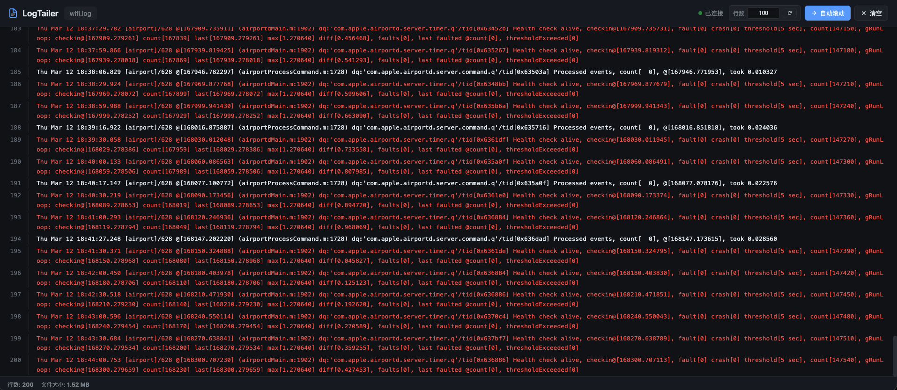

# LogTailer

一个轻量级的实时日志查看 Web 工具，类似于 `tail -f`，但通过浏览器访问，支持手机端查看。



## 功能特性

- **实时日志推送** - 基于 WebSocket，毫秒级延迟
- **历史日志加载** - 启动时显示最近 N 行日志（默认 100 行，可调整至 10000 行）
- **大文件支持** - 从文件末尾读取，支持 GB 级日志文件
- **多编码支持** - 自动检测 UTF-8/GBK 编码
- **日志高亮** - 根据日志级别自动着色
  - 🔴 ERROR / FATAL / PANIC
  - 🟡 WARN / WARNING
  - 🔵 INFO / NOTICE
  - 🟣 DEBUG / TRACE
  - 🟢 SUCCESS / OK / DONE
- **响应式设计** - 自适应手机、平板、PC 屏幕
- **密码保护** - 可选的访问认证功能
- **单文件部署** - 无需任何依赖，开箱即用

## 安装

### 下载预编译版本

从 [Releases](../../releases) 页面下载对应平台的二进制文件：

| 平台 | 架构 | 文件名 |
|------|------|--------|
| macOS | Intel | `logtailer_darwin_amd64` |
| macOS | Apple Silicon | `logtailer_darwin_arm64` |
| Linux | x64 | `logtailer_linux_amd64` |
| Linux | ARM64 | `logtailer_linux_arm64` |
| Windows | x64 | `logtailer_windows_amd64.exe` |
| Windows | ARM64 | `logtailer_windows_arm64.exe` |

### 从源码构建

```bash
git clone https://github.com/your-repo/logtailer.git
cd logtailer
go build -o logtailer .
```

## 使用方法

### 基本用法

```bash
./logtailer /path/to/your.log
```

然后在浏览器访问 `http://localhost:8080`

### 命令行参数

```
用法: logtailer [选项] <日志文件>

选项:
  --host string    监听地址 (默认 "0.0.0.0")
  --port int       HTTP服务端口 (默认 8080)
  --lines int      显示的历史日志行数 (默认 100)
  --auth string    访问密码（留空则无需认证）
```

### 示例

```bash
# 基本用法
./logtailer app.log

# 指定端口
./logtailer app.log --port 9000

# 仅本地访问
./logtailer app.log --host 127.0.0.1

# 显示更多历史日志
./logtailer app.log --lines 500

# 启用密码保护
./logtailer app.log --auth mypassword

# 组合使用
./logtailer /var/log/syslog --host 0.0.0.0 --port 8080 --lines 200 --auth secret
```

## 界面功能

### 顶部工具栏

- **文件名显示** - 显示当前监听的日志文件名
- **连接状态** - 实时显示 WebSocket 连接状态
- **行数输入** - 可动态调整显示的历史日志行数（1-10000）
- **自动滚动** - 切换是否自动滚动到最新日志
- **清空** - 清空当前显示的日志（不影响源文件）

### 底部状态栏

- **行数统计** - 当前显示的日志行数
- **文件大小** - 日志文件的实时大小

### 快捷操作

- 点击右下角按钮可快速滚动到底部
- 手动滚动时自动暂停自动滚动

## 使用场景

- 服务器日志实时监控
- 应用调试时查看日志
- 多人共享查看同一日志文件
- 移动端远程查看服务器日志

## 技术栈

- **后端**: Go + gorilla/websocket + fsnotify
- **前端**: 原生 HTML/CSS/JavaScript（无框架依赖）
- **通信**: WebSocket 实时推送

## License

MIT License
